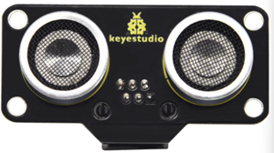
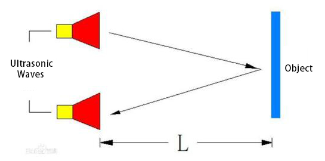
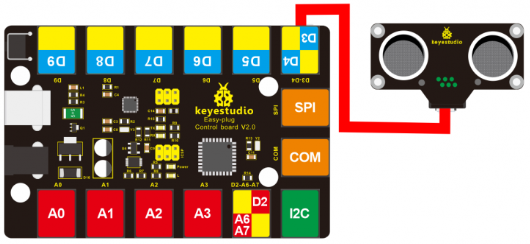
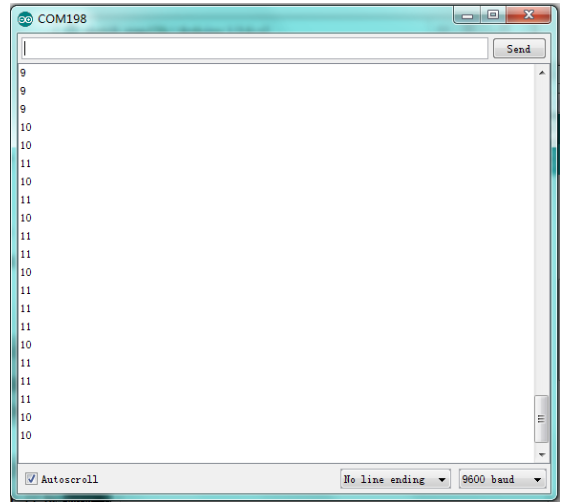

# KS2003 EASY Plug SR01 Ultrasonic Sensor



## 1. Description

Ultrasonic sensors use sonar to determine the distance from the object. This module uses a CS100A chip that can test the distance from 4 cm to 300 cm is unequal, easy to use. Its measure distance is accurate and stable, which can be applied to distance measurements, robots, anti-theft devices, etc.

This module works with V2.0 Easy Plug control board. The module includes an ultrasonic transmitter, a receiver, and a corresponding control circuit. Additionally, it comes with 4 round holes, which is convenient for customers to fix them on other devices.

## 2. Working Principle

1.Use IO to trigger 10us high level signals


2.Automatically send eight 40khz square waves and detect if there are signals are sent back.


3.If there are signals back, output a high level via IO. Then the duration time is time when the ultrasonic waves are sent and Returns.


Measured distance(L) =(high level time* the speed of time(340M/S))/2.



3.Parameters：

- Working voltage: 3.3-5V (DC)
- Work current: 65mA
- Working frequency: 40KHz
- Maximum distance: 300cm
- Minimum distance: 4cm
- Measurement angle: 15 degrees
- Trigger input signal: 10μs TTL pulse
- Interface: RJ11 interface
- Size: 49 * 22 * 19mm
- Weight: 9.2g

## 3. Connection Diagram



## 4. Arduino Code

Download code: [Code](./Code.7z)

```c
#define echoPin 4 // Echo Pin
#define trigPin 3// Trigger Pin
#define LEDPin 13 // Onboard LED

int maximumRange = 200; // Maximum range needed
int minimumRange = 0; // Minimum range needed
long duration, distance; // Duration used to calculate distance

void setup() 
{
  Serial.begin (9600);
  pinMode(trigPin, OUTPUT);
  pinMode(echoPin, INPUT);
  pinMode(LEDPin, OUTPUT); // Use LED indicator (if required)
}

void loop() 
{
  /* The following trigPin/echoPin cycle is used to determine the
  distance of the nearest object by bouncing soundwaves off of it. */ 
  digitalWrite(trigPin, LOW); 
  delayMicroseconds(2); 

  digitalWrite(trigPin, HIGH);
  delayMicroseconds(10); 
  digitalWrite(trigPin, LOW);
  duration = pulseIn(echoPin, HIGH);
  //Calculate the distance (in cm) based on the speed of sound.
  distance = duration/58.2;
  if (distance >= maximumRange || distance <= minimumRange)
  {
      /* Send a negative number to computer and Turn LED ON 
      to indicate "out of range" */
      Serial.println("-1");
      digitalWrite(LEDPin, HIGH); 
  }
  else 
  {
     /* Send the distance to the computer using Serial protocol, and
 	 turn LED OFF to indicate successful reading. */
 	 Serial.println(distance);
 	 digitalWrite(LEDPin, LOW); 
  }
  //Delay 50ms before next reading.
  delay(50);
}
```

## 5. Test Result

Wire it up, burn the code, open the serial monitor and set the baud rate to 9600. you can see the distance value between the ultrasonic sensor and the obstacle, as shown below.

